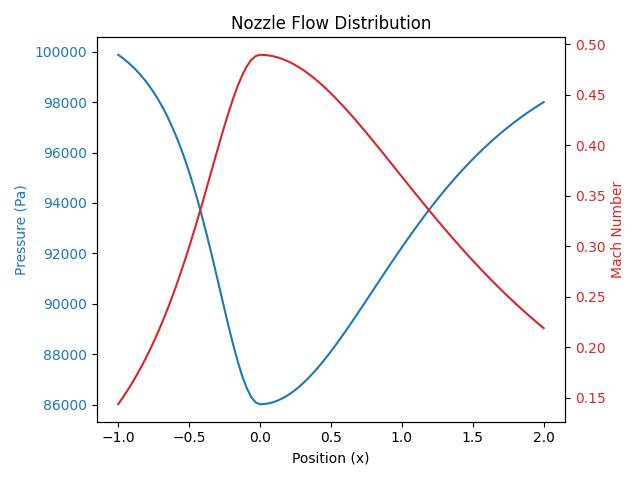
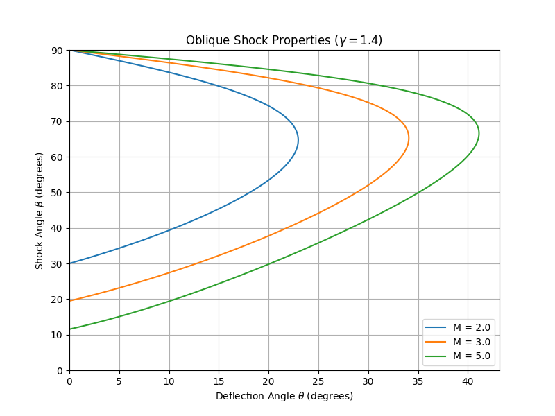
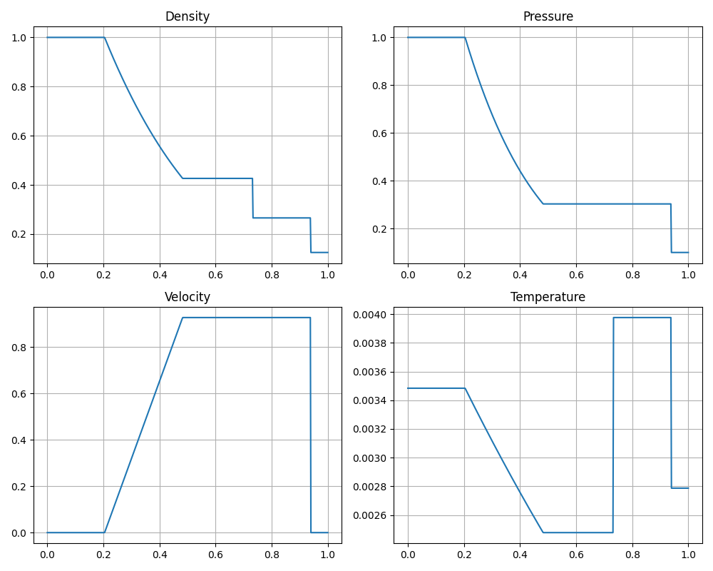

# Rankine

Rankine is a high-performance Python library for analytic and semi-analytic compressible flow calculations. It is architected to accompany the KTH SG2215 Compressible Flow curriculum, serving as both a pedagogical tool and a verification utility for Senior CFD Engineers validating numerical solvers (e.g., OpenFOAM).

The library covers the full spectrum of inviscid gas dynamics, from isentropic nozzle flows to unsteady non-linear wave propagation.


## 📚 Syllabus Coverage (SG2215)

This project implements the maximal syllabus as defined by the KTH Department of Mechanics:

| Module | Syllabus Topic | Implemented Features |
| :--- | :--- | :--- |
| **Isentropic Flow** | Quasi 1D stationary flow | Area-Mach relations, Choked flow detection, Converging-Diverging (CD) Nozzle solver. |
| **Shock Waves** | Normal & Oblique shocks | Rankine-Hugoniot relations, $\theta-\beta-M$ solver, Entropy jump calculations. |
| **Expansion** | Simple expansion waves | Prandtl-Meyer function $\nu(M)$, Expansion fan visualization. |
| **Unsteady Flow** | 1D Non-linear waves | Exact Riemann Solver for the Sod Shock Tube problem ($x-t$ diagrams). |
| **Aerodynamics** | Linear theory | Ackeret's Theory ($C_p$ for supersonic airfoils), Prandtl-Glauert correction. |
| **Hypersonic** | Special effects | Newtonian impact theory for high Mach number approximation. |

## 🚀 Installation

```bash
git clone https://github.com/your-username/rankine.git
cd rankine
pip install -r requirements.txt
```

## 🌐 Web Interface (Vercel)

This project includes a web interface for interactive calculations and plotting, deployable on Vercel.

To run locally:
```bash
python api/index.py
```
Then open `http://localhost:5000`.

## 📊 Artifacts & Usage

The following outputs are generated directly by the rankine library.

### 1. Quasi-1D Nozzle Flow

Calculates pressure and Mach number distribution through a De Laval nozzle.

```python
from rankine.isentropic import CDNozzle

# Define nozzle: Inlet (stagnation), Throat Area, Exit Area
nozzle = CDNozzle(gamma=1.4, A_throat=0.05, A_exit=0.1)
results = nozzle.solve(P0=101325, T0=300, back_pressure=95000)

results.plot_distribution()
```

**Artifact Output:**



Graph showing normalized Pressure ($P/P_0$) dropping as Mach number ($M$) increases through the throat ($x=0$). The plot visualizes the transition from subsonic to supersonic flow if the back pressure is sufficiently low.

### 2. Oblique Shock Polar

Visualizes the relationship between deflection angle ($\theta$) and shock wave angle ($\beta$).

```python
from rankine.shocks import ObliqueShock
import matplotlib.pyplot as plt

# Generate Shock Polar for Mach 2.0, 3.0, and 5.0
ObliqueShock.plot_polar(mach_numbers=[2.0, 3.0, 5.0], gamma=1.4)
```

**Artifact Output:**



A "Shock Polar" diagram. The Y-axis represents pressure ratio or wave angle, and the X-axis represents flow deflection angle. The chart illustrates the maximum deflection angle ($\theta_{max}$) possible before the shock detaches.

### 3. Unsteady 1D Waves (Sod Shock Tube)

Solves the Riemann problem to show the time-evolution of a diaphragm rupture.

```python
from rankine.unsteady import ShockTube

# Left state (High P) | Right state (Low P)
driver_gas = {'p': 1.0, 'rho': 1.0, 'u': 0.0}
driven_gas = {'p': 0.1, 'rho': 0.125, 'u': 0.0}

tube = ShockTube(driver_gas, driven_gas, gamma=1.4)
tube.solve(time=0.25)
tube.plot_properties()
```

**Artifact Output:**



A 4-subplot figure showing Density, Pressure, Temperature, and Velocity vs. Position ($x$) at time $t=0.25s$. Distinctly visible are:
- Expansion Fan (left)
- Contact Discontinuity (middle)
- Shock Wave (right)

## 🧪 Testing Strategy

This project employs a strict Test-Driven Development (TDD) approach using pytest.

### Unit Tests
Located in `tests/unit/`, these validate specific physics functions against standard gas tables (e.g., Anderson's Modern Compressible Flow Appendix).

Example: `tests/unit/test_shocks.py`
```python
def test_normal_shock_mach():
    from rankine.shocks import NormalShock
    # Known data: M1 = 2.0, Gamma = 1.4 -> M2 should be 0.5774
    ns = NormalShock(M1=2.0, gamma=1.4)
    assert abs(ns.M2 - 0.57735) < 1e-4
```

### E2E Tests
Located in `tests/e2e/`, these simulate full workflows to ensure conservation laws are held globally.

Example: `tests/e2e/test_nozzle_design.py`
```python
def test_mass_conservation_nozzle():
    # Mass flow rate should be constant at inlet, throat, and exit
    nozzle = CDNozzle(A_throat=1.0, A_exit=2.0, A_inlet=3.0)
    res = nozzle.solve_isentropic(M_inlet=0.1)

    mdot_in = res.rho[0] * res.u[0] * res.A[0]
    mdot_ex = res.rho[-1] * res.u[-1] * res.A[-1]

    assert abs(mdot_in - mdot_ex) < 1e-5
```

## ⚖️ License

MIT License

Copyright (c) 2026
